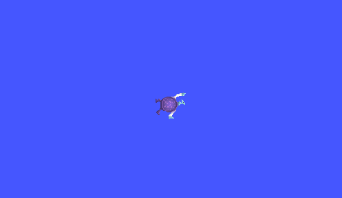
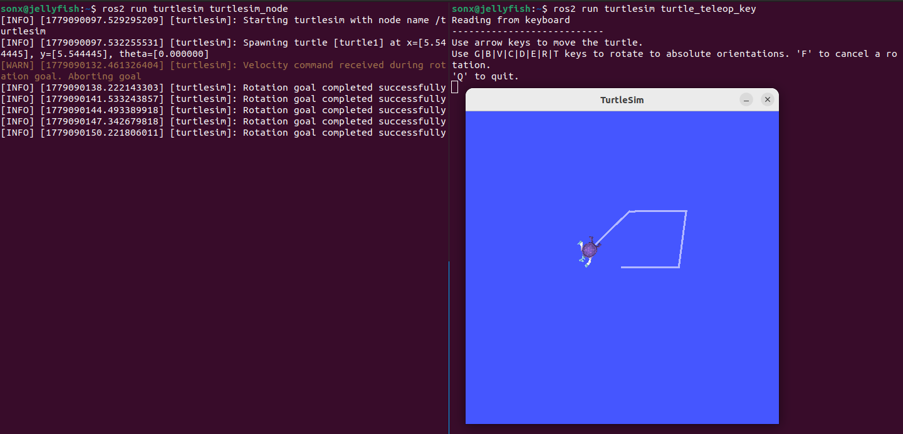
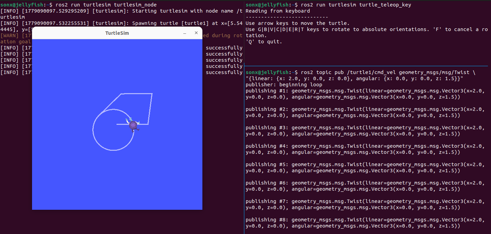
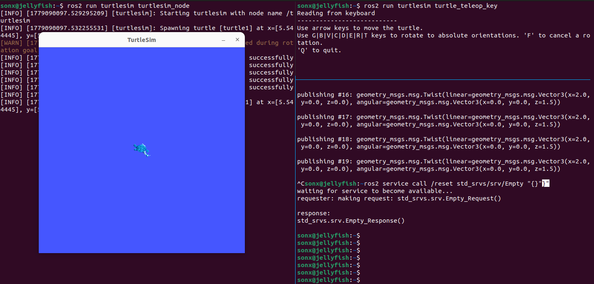
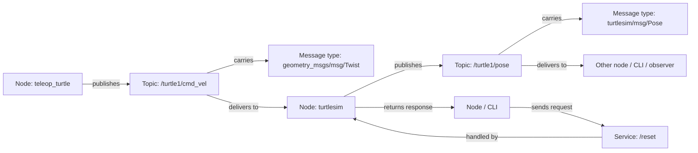

# ROS2 Turtlesim Basics

ROS2 (Robot Operating System 2) is a framework for building robotic applications.

## Installation

- OS: Ubuntu 22.04
- ROS2 distro: Humble
- Demo package: turtlesim
- Installation command guide: https://docs.ros.org/en/humble/Installation/Ubuntu-Install-Debs.html

Command summary:

```bash
sudo apt update
sudo apt upgrade -y

# Enable universe repository
sudo apt install software-properties-common -y
sudo add-apt-repository universe -y

# Add ROS2 repository
sudo apt update
sudo apt install curl gnupg lsb-release -y

# Add ROS2 GPG key
sudo curl -sSL https://raw.githubusercontent.com/ros/rosdistro/master/ros.key \
  -o /usr/share/keyrings/ros-archive-keyring.gpg

# Add ROS2 repository to sources list
echo "deb [arch=$(dpkg --print-architecture) signed-by=/usr/share/keyrings/ros-archive-keyring.gpg] \
http://packages.ros.org/ros2/ubuntu $(. /etc/os-release && echo $UBUNTU_CODENAME) main" | \
sudo tee /etc/apt/sources.list.d/ros2.list > /dev/null

sudo apt update

# Install ROS2 Humble desktop
sudo apt install ros-humble-desktop -y

# Install build tools
sudo apt install python3-colcon-common-extensions python3-rosdep python3-vcstool git -y

# Initialize rosdep
sudo rosdep init
rosdep update

# Add ROS2 environment to bashrc
echo "source /opt/ros/humble/setup.bash" >> ~/.bashrc
source ~/.bashrc

# Install turtlesim
sudo apt install ros-humble-turtlesim -y
```

Check installation:

```bash
ros2 --help
```

## Running the Simulator

Once the installation is complete:

Open Terminal 1 and run the following command to start the turtlesim simulator:

```bash
ros2 run turtlesim turtlesim_node
```
A window should pop up showing a blue background with a turtle in the middle. This is the turtlesim simulator, which provides a simple environment for learning ROS2 concepts.



Open Terminal 2 and run:

```bash
ros2 run turtlesim turtle_teleop_key
```
This will allow you to control the turtle using your keyboard. Use the arrow keys to move the turtle around the screen.



## Basic ROS2 Concepts

Think of a robot as consisting of many small programs talking to each other. For example:

```text
camera node  ---> publishes /camera/image
lidar node   ---> publishes /scan
nav node     ---> subscribes /scan, publishes /cmd_vel
motor node   ---> subscribes /cmd_vel and moves robot
```

In ROS2, these programs are called nodes.

Key ROS2 concepts to understand:

- **Node:** A ROS2 program/process. It can publish data, subscribe to data, expose services, call services, run actions, or combine many of these.
- **Topic:** A one-way asynchronous data stream. Usually used for continuous data like velocity commands, sensor data, camera frames, pose, and logs.
- **Publisher:** A node that sends messages to a topic.
- **Subscriber:** A node that receives messages from a topic.
- **Message:** A structured data type sent over a topic. Example: `geometry_msgs/msg/Twist`.
- **Service:** A request/response RPC-like call exposed by a node. Used for quick operations that return a result.
- **Action:** A long-running goal/task interface. Similar to a service, but supports progress feedback and cancellation.

### Listing Nodes

```bash
ros2 node list
```

Observed:
```
/teleop_turtle
/turtlesim
```

There are two nodes: the simulator node and the teleop node. The teleop node is responsible for taking keyboard input and publishing velocity commands to the simulator node, which moves the turtle accordingly.

### Inspecting Nodes

Inspect the simulator node:

```bash
ros2 node info /turtlesim
```
Observed:
```
/turtlesim
  Subscribers:
    /parameter_events: rcl_interfaces/msg/ParameterEvent
    /turtle1/cmd_vel: geometry_msgs/msg/Twist
  Publishers:
    /parameter_events: rcl_interfaces/msg/ParameterEvent
    /rosout: rcl_interfaces/msg/Log
    /turtle1/color_sensor: turtlesim/msg/Color
    /turtle1/pose: turtlesim/msg/Pose
  Service Servers:
    /clear: std_srvs/srv/Empty
    /kill: turtlesim/srv/Kill
    /reset: std_srvs/srv/Empty
    /spawn: turtlesim/srv/Spawn
    /turtle1/set_pen: turtlesim/srv/SetPen
    /turtle1/teleport_absolute: turtlesim/srv/TeleportAbsolute
    /turtle1/teleport_relative: turtlesim/srv/TeleportRelative
    /turtlesim/describe_parameters: rcl_interfaces/srv/DescribeParameters
    /turtlesim/get_parameter_types: rcl_interfaces/srv/GetParameterTypes
    /turtlesim/get_parameters: rcl_interfaces/srv/GetParameters
    /turtlesim/list_parameters: rcl_interfaces/srv/ListParameters
    /turtlesim/set_parameters: rcl_interfaces/srv/SetParameters
    /turtlesim/set_parameters_atomically: rcl_interfaces/srv/SetParametersAtomically
  Service Clients:

  Action Servers:
    /turtle1/rotate_absolute: turtlesim/action/RotateAbsolute
  Action Clients:
```

Key observations:

The `/turtlesim` node exposes several ROS2 communication interfaces:

- It subscribes to `/turtle1/cmd_vel`, which accepts `geometry_msgs/msg/Twist` movement commands.
- It publishes `/turtle1/pose`, which leaks the turtle's current position and velocity.
- It publishes `/turtle1/color_sensor`, representing sensor-like output.
- It exposes state-changing services such as `/reset`, `/spawn`, `/kill`, and teleport services.
- It exposes ROS2 parameter services, which allow runtime configuration inspection and modification.
- It exposes an action server `/turtle1/rotate_absolute`, representing a long-running behavior command.

### Inspecting Topics

A topic is a continuous stream of messages.

Inspect the command topic:

```bash
ros2 topic info /turtle1/cmd_vel
```
Observed:
```
Type: geometry_msgs/msg/Twist
Publisher count: 1
Subscriber count: 1
```

`/turtle1/cmd_vel` uses the `geometry_msgs/msg/Twist` message type.

```bash
ros2 interface show geometry_msgs/msg/Twist
```

Observed:
```
# This expresses velocity in free space broken into its linear and angular parts.

Vector3  linear
	float64 x
	float64 y
	float64 z
Vector3  angular
	float64 x
	float64 y
	float64 z
```

Important fields:

- `linear.x`: forward/backward movement
- `angular.z`: rotation

### Inspecting Services

A service is a callable function exposed by a node that returns a response.

```bash
ros2 service list
```

Observed:
```
/clear
/kill
/reset
/spawn
/teleop_turtle/describe_parameters
/teleop_turtle/get_parameter_types
/teleop_turtle/get_parameters
/teleop_turtle/list_parameters
/teleop_turtle/set_parameters
/teleop_turtle/set_parameters_atomically
/turtle1/set_pen
/turtle1/teleport_absolute
/turtle1/teleport_relative
/turtlesim/describe_parameters
/turtlesim/get_parameter_types
/turtlesim/get_parameters
/turtlesim/list_parameters
/turtlesim/set_parameters
/turtlesim/set_parameters_atomically
```

### Manual Command Publishing

Open Terminal 3 and run:

```bash
ros2 topic pub /turtle1/cmd_vel geometry_msgs/msg/Twist \
"{linear: {x: 2.0, y: 0.0, z: 0.0}, angular: {x: 0.0, y: 0.0, z: 1.5}}"
```

This command publishes a velocity command of type `geometry_msgs/msg/Twist` to the `/turtle1/cmd_vel` topic, which causes the turtle to move forward and rotate at the same time, drawing a circle.




```bash
ros2 service call /reset std_srvs/srv/Empty "{}"
```
This command calls the `/reset` service of the `/turtlesim` node, which resets the turtle to its initial position and orientation.



### Data Flow Summary



## Security Notes

An unsecured ROS2 graph allows another node/process to discover topics and publish compatible messages.

Potential impact on real robots:

- Unauthorized movement command injection
- Sensor/state data leakage
- Unsafe service calls
- Robot behavior manipulation

