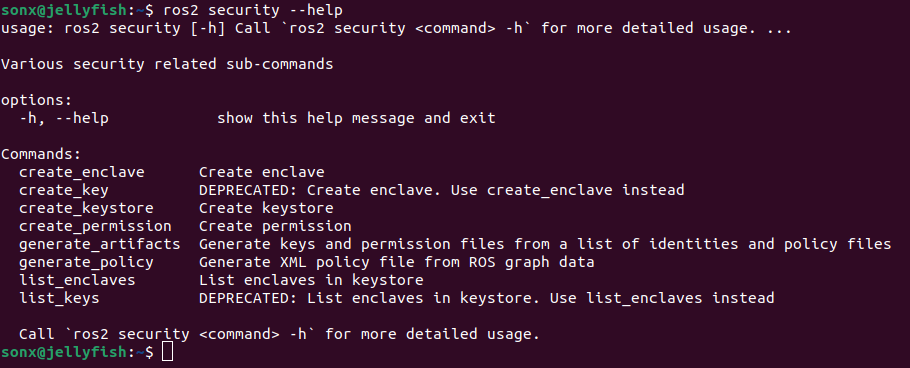
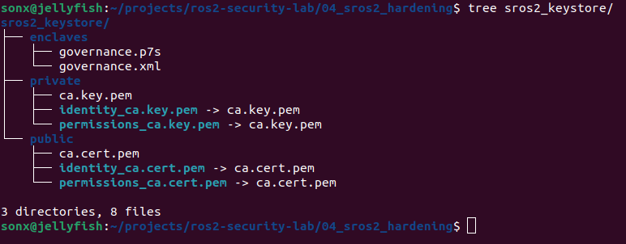
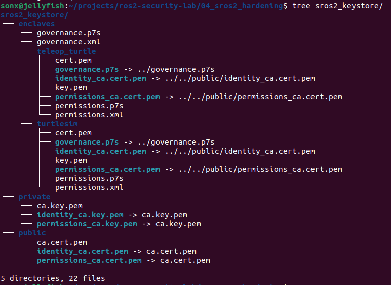

# SROS2 Hardening

Enable ROS2 security and test whether the previous unauthorized `/cmd_vel` attacker can still control the simulator.

## Baseline

Before SROS2, the attacker node could:

- publish unauthorized `Twist` messages to `/turtle1/cmd_vel`
- move the turtle
- subscribe to `/turtle1/pose`
- read turtle position/state data

### Install SROS2 Tools

```bash
sudo apt update
sudo apt install ros-humble-sros2 -y
```

### Check Command Exists

```bash
ros2 security --help
```




### Create Keystore

```bash
ros2 security create_keystore sros2_keystore
```




### Set Environment Variables

```bash
export ROS_SECURITY_KEYSTORE=$HOME/projects/ros2-security-lab/04_sros2_hardening/sros2_keystore
```

### Create Security Enclaves

An enclave is like a security identity/context for a ROS2 process. ROS2’s security design uses enclaves to store runtime security artifacts for secure processes.

Create enclaves for legitimate nodes:

```bash
ros2 security create_key sros2_keystore /turtlesim
ros2 security create_key sros2_keystore /teleop_turtle
```



### Enable Security Environment

These environment variables should be set everywhere you run protected nodes:

```bash
export ROS_SECURITY_KEYSTORE=$HOME/projects/ros2-security-lab/04_sros2_hardening/sros2_keystore
export ROS_SECURITY_ENABLE=true
export ROS_SECURITY_STRATEGY=Enforce
```

- `ROS_SECURITY_KEYSTORE`: where security files live
- `ROS_SECURITY_ENABLE=true`: turn security on
- `ROS_SECURITY_STRATEGY=Enforce`: fail if security config is missing/bad

### Run Secure Turtlesim

Open Terminal 1:

```bash
source /opt/ros/humble/setup.bash

export ROS_SECURITY_KEYSTORE=$HOME/projects/ros2-security-lab/04_sros2_hardening/sros2_keystore
export ROS_SECURITY_ENABLE=true
export ROS_SECURITY_STRATEGY=Enforce

ros2 run turtlesim turtlesim_node --ros-args --enclave /turtlesim
```

### Run Secure Teleop

Open Terminal 2:

```bash
source /opt/ros/humble/setup.bash

export ROS_SECURITY_KEYSTORE=$HOME/projects/ros2-security-lab/04_sros2_hardening/sros2_keystore
export ROS_SECURITY_ENABLE=true
export ROS_SECURITY_STRATEGY=Enforce

ros2 run turtlesim turtle_teleop_key --ros-args --enclave /teleop_turtle
```

Try moving the turtle using the arrow keys. The legitimate `teleop_turtle` node still controls the simulator normally.

Now, open Terminal 3 to run the attacker node:

```bash
ros2 run cmd_vel_attacker attacker
```

The attacker node can no longer control the turtle because SROS2 security is enabled and the attacker has no valid security enclave.


### Test Attacker WITH Security but No Key

```bash
export ROS_SECURITY_KEYSTORE=$HOME/projects/ros2-security-lab/04_sros2_hardening/sros2_keystore
export ROS_SECURITY_ENABLE=true
export ROS_SECURITY_STRATEGY=Enforce

ros2 run cmd_vel_attacker attacker --ros-args --enclave /cmd_vel_attacker
```

### Error Output

```
SECURITY ERROR: directory '/home/sonx/projects/ros2-security-lab/04_sros2_hardening/sros2_keystore/enclaves/cmd_vel_attacker' does not exist., at ./src/rcl/security.c:202
```

### Create Attacker Key (Authentication vs. Authorization)

Let's create a key for the attacker to demonstrate that just being authenticated to the ROS2 network doesn't mean they are authorized to perform actions (if access control policies are properly configured).

```bash
ros2 security create_key sros2_keystore /cmd_vel_attacker
ros2 security list_keys sros2_keystore
```

Result: The `/cmd_vel_attacker` is added to the keystore.

```text
/turtlesim
/teleop_turtle
/cmd_vel_attacker
```


```bash
ros2 run cmd_vel_attacker attacker --ros-args --enclave /cmd_vel_attacker
```


Because we haven't configured strict authorization policies yet (DDS-Security permissions), the attacker can now control the turtle simply by having a valid key!

### Try with a Different Enclave

```bash
ros2 run cmd_vel_attacker attacker --ros-args --enclave /teleop_turtle
```

The attacker successfully publishes movement commands to `/turtle1/cmd_vel` by masquerading as the legitimate teleop node.

**Finding:** Enclave identity matters. If an attacker can run using a trusted enclave such as `/teleop_turtle`, they inherit that enclave's permissions. Protecting the keystore files is critical.

## Solutions and Recommendations

### Protect Keystore Files

The SROS2 keystore contains private keys and permissions for each enclave. These files must be protected with strict filesystem permissions. Only the user/service account running the legitimate ROS2 node should be able to read that node's enclave directory.

### Use Least-Privilege Permissions (Access Control)

The `/teleop_turtle` enclave should only be allowed to publish the minimum required topics using DDS-Security permission rules (e.g., `permissions.xml`):

- **Allow publish:** `/turtle1/cmd_vel`
- **Deny subscribe:** `/turtle1/pose` (unless needed)
- **Deny access:** Unrelated services/actions

### Add Application-Level Safety Checks

- Reject commands above safe speed limits
- Require command source validation
- Implement watchdog timeouts (stop moving if legimate commands stop arriving)
